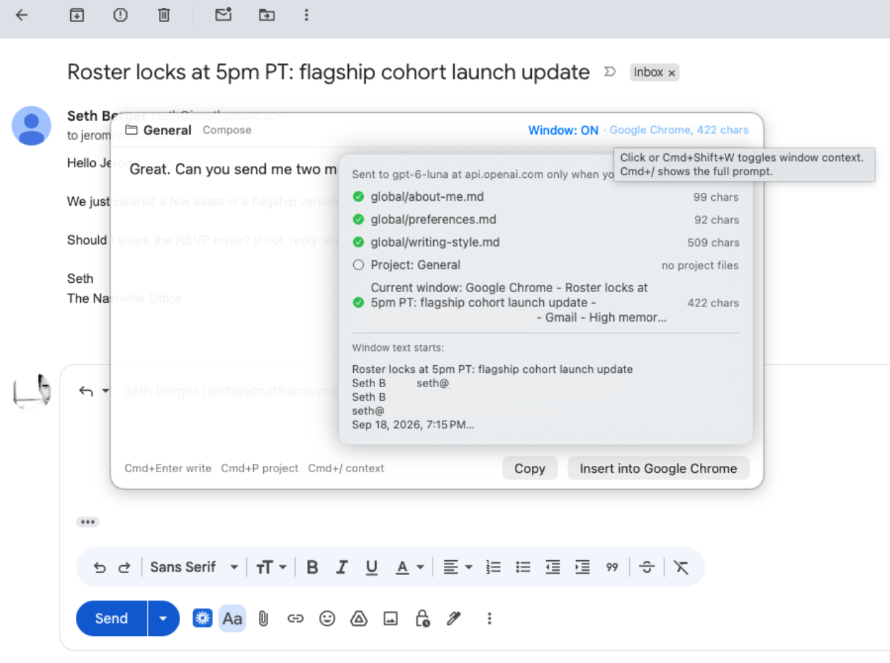
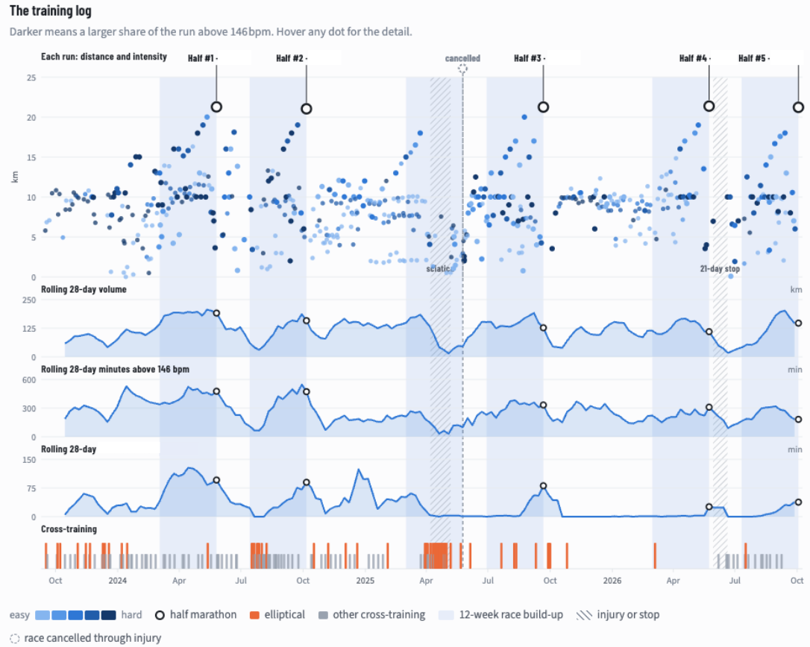

# Jerome Pasquero

I am a technology leader who still likes to build things.

I have spent much of my career leading and managing engineering, product, research, and AI teams, from small groups to larger organizations. I believe that being a credible and effective technology leader also means staying close to the technology itself, especially in a field changing as quickly as AI.

That is why I still build. I use personal and commercial projects to explore new models, tools, architectures, and development workflows firsthand rather than understanding them only at a distance. Getting my hands dirty helps me make better technical decisions, challenge assumptions, and lead teams with a clearer sense of what the technology can actually do.

My work has spanned machine learning, applied AI, product development, research, and engineering leadership. Most of my substantial development repositories are private. Some contain commercial IP, some integrate with private infrastructure, and some are simply software I actively use rather than software I intend to distribute.

This page documents a selection of those projects, their architecture, and some of the engineering decisions behind them. I am happy to walk through the implementation and selected code where appropriate.

## Selected Projects

### AI Vibe

A platform for understanding how organizations use generative AI and identifying opportunities for practical AI adoption.

The system combines a structured database of more than 1,500 workplace tasks with semantic search, embeddings, generative models, organizational assessments, and an AI-based interview system.

A substantial companion pipeline generates and maintains the underlying task catalog. Tasks are produced from seeded domain packs using locally hosted open-weight models, embedded and clustered by semantic similarity, normalized into consistent phrasing, and merged into a canonical task set. An interactive review tool supports keeping, renaming, splitting, and dropping clusters when automated similarity is not enough.

The agent harness described further down was built during this work.

**My role:** Co-founder and CTO

**Technologies:** Python, Cohere models and embeddings, Supabase, Ollama, OpenAI embeddings, semantic clustering, agent-based workflows, semantic retrieval

**Source:** Private

### Home Energy Platform

A system for collecting and analyzing energy usage across my home, including heating, cooling, electric loads, an EV, and environmental telemetry.

It combines data from multiple devices and APIs into a common historical dataset that can be used to understand consumption patterns and eventually optimize energy usage.

**Technologies:** Python, APIs, Docker, time-series data, home automation, IoT

**Source:** Private

### Slip

A personal writing assistant for macOS that I'm building to understand how these systems work underneath. A global shortcut opens a panel in any app where I type or dictate rough notes. Slip returns a draft in my voice, I edit it, then copy or insert it. The original app is untouched until I choose.

I treated it as a set of layers, each one a place to learn something.

**Memory.** What the assistant knows about me is plain Markdown: global files about how I write, and project files I pick per task. There is no database and no hidden profile. Files are re-read when they change, so I can edit its memory in any text editor.

**Perception.** Slip reads the window I was in (Slack, Gmail, Messages) through the macOS accessibility tree, using per-app extractors, since "read everything visible" is wrong in a different way for each app.

**Security.** Before anything leaves the machine, a guard screens it. I implemented a native Swift scanner following gitleaks' design (keyword prefilters, entropy, allowlists), using its rule set. A second detector catches cards, IBANs and Canadian SINs, each confirmed by checksum. Screen content stays in memory only for the session, and a preview shows the exact request before it is sent.

**Output.** Inserting text saves and restores the full clipboard, but only if nobody else wrote to it in between.

The model sits behind a small provider protocol, so any OpenAI-compatible endpoint, hosted or local, will work. Slip is inspired by [ClipSlop](https://github.com/mekedron/ClipSlop) but is not a fork. A few low-level pieces are adapted from it under its MIT license.

**Technologies:** Swift, SwiftUI, AppKit, macOS Accessibility API, Keychain, streaming LLM APIs, gitleaks-style secret detection, Markdown context

**Source:** Private

### LLM-Based Contact Classification

A tool for scoring and classifying large contact lists against a defined commercial objective.

Scoring dimensions, rubrics, and additional classifications live in JSON profiles rather than in code, so the same pipeline can evaluate the same contacts against entirely different objectives: potential clients for one venture, data partners or strategic partners for another. Contacts are processed in batches, with caching, retries, and a shared client that puts locally hosted and hosted commercial models behind a single interface.

**Technologies:** Python, Ollama, OpenAI and Claude APIs, profile-driven rubrics, batch processing

**Source:** Private

### Folio

A self-hosted personal finance platform for consolidating financial accounts, investments, holdings, fees, and historical performance across multiple financial institutions.

Folio is built on [Tally](https://github.com/yrameshk26/Tally), which provided the starting point for the financial data model and application. I extended it around my own data pipeline and infrastructure, including a read-only net-worth MCP server that lets Claude query accounts, holdings, balances, and historical financial data without exposing write access.

The project explores financial data ingestion, normalization, account reconciliation, investment analytics, and privacy-conscious AI-assisted development.

**Technologies:** TypeScript, Node.js, PostgreSQL, APIs, MCP, Claude, self-hosted infrastructure

**Source:** Private

### FitLab

A local analytics platform over years of Apple Watch fitness data, built to answer a deceptively simple question: has my cardio actually improved, and has my easy pace improved at the same heart rate?

Hundreds of runs and millions of per-second samples are parsed directly from raw `.fit` files into Parquet and queried through DuckDB. Tables are views over the underlying files rather than loaded copies, so ingest requires no migrations and queries always reflect the latest data. Ingest is incremental and keyed on each workout's embedded session UUID, preventing re-exported or renamed workouts from being counted twice.

A large part of the project is about avoiding misleading conclusions from imperfect longitudinal data. A watch replacement changed Apple's treadmill distance calibration enough to create an apparent collapse in fitness, while Apple's age-adjusted heart rate zones introduced a moving baseline into year-over-year comparisons. FitLab corrects both explicitly, retaining raw measurements while applying its own calibration and a frozen threshold-based heart rate model.

The analysis also derives descent from the per-second barometric altitude stream and grade-adjusts pace before comparing runs across different terrain. Half-marathon performances provide real-world checkpoints against the trends inferred from training data.

Body mass is part of the same dataset. A small companion service reads my bathroom scale directly over the LAN after the manufacturer shut down the cloud service it previously depended on, and merges those measurements into the same analytical store.

**Technologies:** Python, DuckDB, Parquet, pyarrow, FIT decoding, SQL analytics, Grafana, Docker, systemd

**Source:** Private

### Home Infrastructure

A small collection of Linux systems that run storage, media, backups, monitoring, networking, UPS management, and home automation services.

This has increasingly become a playground for experimenting with lightweight distributed infrastructure, remote administration, containers, observability, and resilient services.

**Technologies:** Debian, Docker, Tailscale, NUT, systemd, NAS storage, Linux networking

**Source:** Private

### Home Frame

A wall-mounted digital art display built around a repurposed screen and integrated into my home infrastructure. On a daily basis, it pulls art from The Met, the Cleveland Museum of Art, the Art Institute of Chicago, Wikimedia Commons, NASA, and Pexels.

The system is designed to make the display behave more like a framed artwork than a conventional screen, with remotely managed content and automation controlling what is shown and when.

**Technologies:** Linux, display automation, remote administration, home infrastructure

**Source:** Private

### Camera and Event Processing

A self-hosted video and computer vision pipeline built around consumer Eufy cameras.

The project includes extracting camera streams and events outside the vendor application, exposing HEVC video locally through go2rtc, and experimenting with computer vision models including YOLO for object detection and SAM 3 for segmentation.

The goal is to turn otherwise closed consumer camera hardware into an open local processing pipeline that can support custom automation, analysis, and event detection.

**Technologies:** Docker, go2rtc, FFmpeg, HEVC, Eufy SDK bridge, YOLO, SAM 3, computer vision, event-driven processing

**Source:** Private

### QuizMe

A small web application I built when my daughter started high school to help her practice quiz questions for her studies. It covers multiple-choice quizzes and French dictation exercises.

Quizzes are plain JSON files per subject, and the application tracks which questions each child has already been asked so a set can be worked through without repetition. The dictation module plays back pre-generated audio for each sentence, then compares what was typed against the original using fuzzy and accent-insensitive matching and highlights exactly where the two differ.

**Technologies:** Python, Flask, SQLite, audio playback, text similarity matching

**Source:** Private

## Agent Harness

Not a separate repository. This is the agent layer inside the AI Vibe platform, plus shared client and pipeline code reused across several of the projects above. I started building it because the work required it, before this kind of system had settled vocabulary and before there were frameworks worth copying, and I have since replaced parts of it with standard components where those turned out to be better than mine.

**An agent that audits the platform.** A data coherence agent validates cross-module consistency in live platform data and reports what it finds. Missions are declarative Markdown documents stating an objective, steps, checks, and an output format, so adding an audit means adding a file rather than writing code. Current missions compare survey configuration against generated report data, verify that the same organization resolves consistently across two separate modules, check scoring model internals, and run a fast endpoint smoke test. Reports persist to the platform and render in an internal dashboard, and findings that prove to be real bugs are promoted to tracked issues.

**A least-privilege tool surface.** The agent reaches the platform over MCP, through a tool spec generated from the API and filtered down to read methods only, with sensitive paths excluded before the agent ever sees them. Credentials are injected by the runner and never appear in the prompt. The agent can read everything it needs in order to reason, and change nothing.

**Two execution substrates behind one control plane.** Depending on how an environment is provisioned, a mission either executes in the backend directly or is persisted as pending and claimed by a poller that runs it through an interactive agent session and posts the report back. Triggering an audit is the same action either way, and the queued path means an environment without direct model access is not an environment without audits. Model tier and a per-run spending cap are parameters rather than constants, so the cost of an audit is a dial rather than a discovery.

**Deterministic checks and model judgment, kept apart.** A content quality engine runs rule-based and heuristic validation alongside prompt-driven evaluation, with each model check isolated in its own prompt file: semantic drift, task granularity, identifier and text coherence, collection coherence, and tone. Separating the deterministic layer from the probabilistic one means a regression in either cannot hide inside the other.

**Unattended runs that survive their own failures.** Shared across the pipeline projects: one calling interface over self-hosted open-weight models up to 70B and the OpenAI and Anthropic APIs, so moving a workload between them is a flag rather than a rewrite. Retries classify failures, so timeouts, server errors, and rate limits are retried while other client errors are raised immediately instead of consuming four more attempts on a request that cannot succeed. Model output is extracted, parsed, and validated field by field against a declared shape, with parse failures logged to JSONL beside the records that caused them rather than aborting the run. Records carry deterministic content-hashed identifiers and results append incrementally, so an interrupted job resumes instead of restarting.

**Tasks and audits defined as data.** Classification work lives in JSON profiles declaring dimensions, rubrics, permitted values, and rules, and the prompt, including a synthesized example of the required output shape, is generated from the profile. Coherence missions follow the same principle in Markdown. In both cases the pipeline is fixed and the intent is configuration, which is why the same code can score contacts against unrelated objectives or audit unrelated invariants.

**Human review as a pipeline stage.** Multi-stage pipelines checkpoint their artifacts between stages, and review is a stage rather than an afterthought: clusters and canonical choices can be kept, renamed, split, or dropped interactively, and those decisions persist back into the pipeline.

**What I adopted and what I wrote.** Adopted: MCP as the tool transport, and the skill, hook, and plugin model for configuring agents. Written: an MCP server exposing platform data read-only to desktop agent clients, a set of operator skills with shared includes and an installer, packaged as a plugin and versioned next to the code so that the build agent can see how the platform is actually used in the field, a pre-tool-use hook that blocks writes to reference repositories, and a CLI over the same API. Knowing which of those two columns a given problem belongs in is where the engineering judgment actually lives.

**Technologies:** Python, TypeScript, modular service backend, MCP, Claude models across tiers, Ollama with open-weight models up to 70B, OpenAI and Anthropic APIs, declarative missions and task profiles, JSONL observability, checkpointed pipelines

## About the Code

I keep most of my current development repositories private because they contain proprietary work, private infrastructure details, or projects that are not intended for public distribution.

I am happy to walk through the architecture, implementation decisions, and selected code where appropriate.
