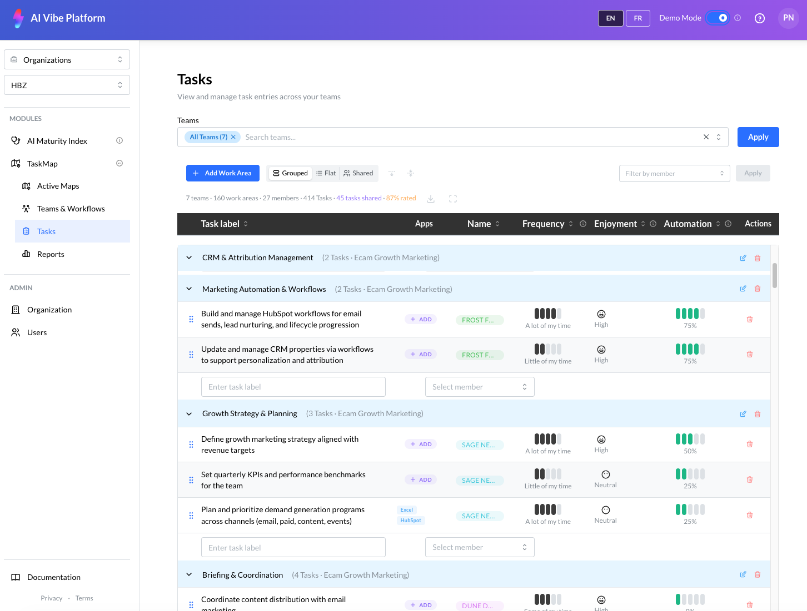
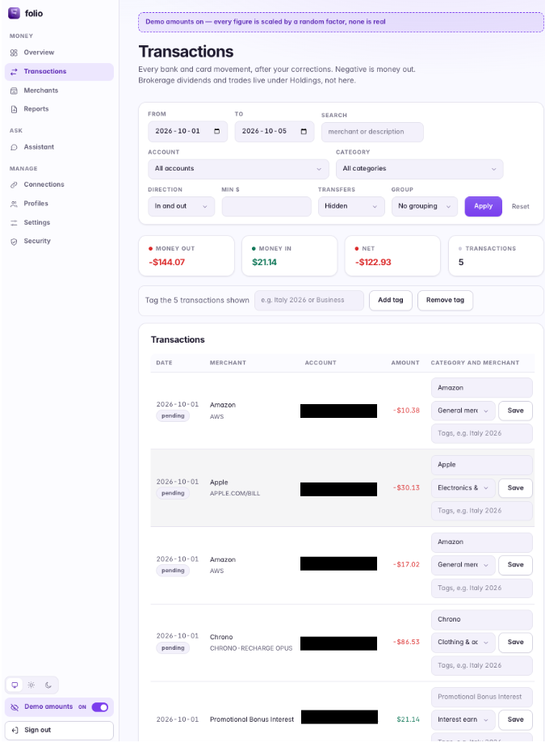
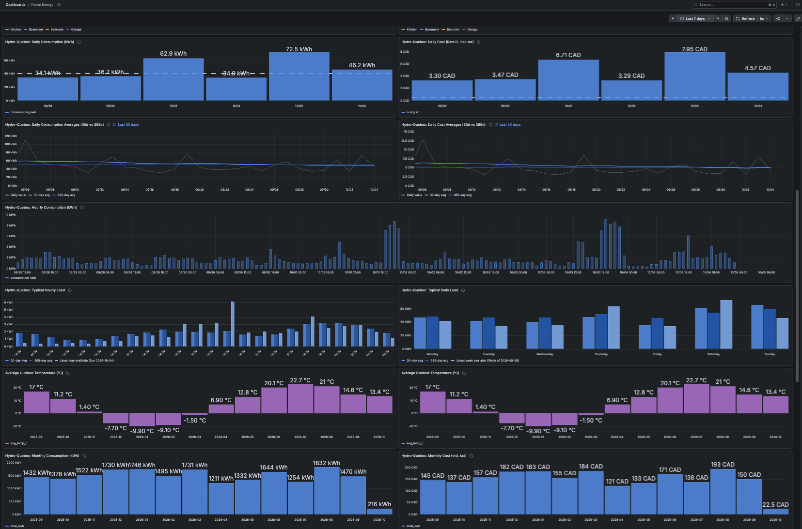
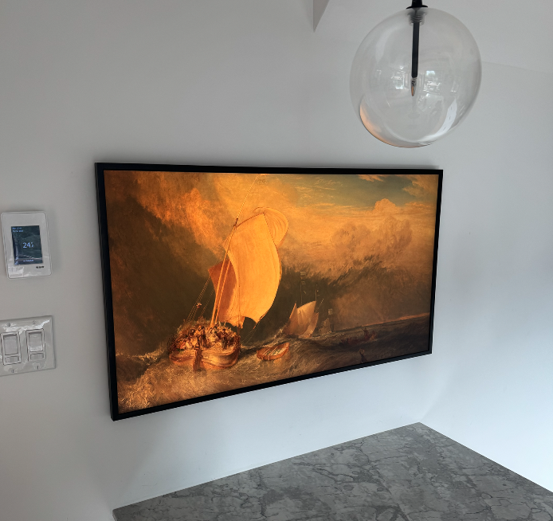
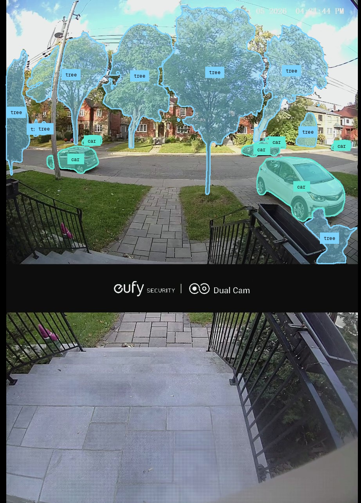
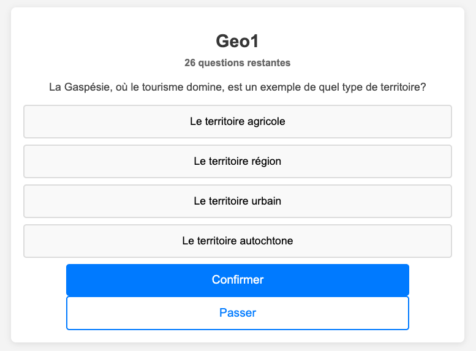

# Jerome Pasquero

I am an AI and technology leader who still likes to build things.

My work has spanned machine learning, applied AI, product development, research, and engineering leadership. Outside of larger commercial projects, I regularly build systems to explore technologies, solve problems I actually have, and understand new tools from the inside.

Most of my substantial development repositories are private. Some contain commercial IP, some integrate with private infrastructure, and some are simply software I actively use rather than software I intend to distribute.

This page documents a selection of those projects, their architecture, and some of the engineering decisions behind them. I am happy to walk through the implementation and selected code where appropriate.

## Selected Projects

### AI Vibe

A platform for understanding how organizations use generative AI and identifying opportunities for practical AI adoption.

The system combines a structured database of more than 1,500 workplace tasks with semantic search, embeddings, generative models, organizational assessments, and an AI based interview system.

The agent harness described further down was built during this work.

**My role:** Co founder and CTO

**Technologies:** Python, Cohere models and embeddings, Supabase, agent based workflows, semantic retrieval

**Source:** Private

### Synthetic Task Catalogs

A pipeline for generating large volumes of realistic workplace tasks and reducing them to a clean canonical catalog.

Tasks are generated from seeded domain packs using locally hosted open weight models, embedded, clustered by semantic similarity, normalized into consistent phrasing through verb mapping and removal of tool and context specific terms, then merged across clusters in embedding space. The output is a canonical task table, embeddings for each canonical task, and a mapping from every generated task back to the canonical form it belongs to.

The generation is the easy part. The interesting work is everything after it: deciding when two differently worded tasks are in fact the same task, and doing that consistently enough to build a catalog on. The pipeline pairs automated thresholds with an interactive review tool for keeping, renaming, splitting, or dropping clusters.

**Technologies:** Python, Ollama with open weight models, OpenAI embeddings, similarity based clustering, UMAP visualization, interactive review tooling

**Source:** Private

### Synthetic Banking Communication Data

A generator that produces synthetic small business banking relationships for churn prediction and customer relationship analysis.

Each generated customer has a loan, a risk profile, a communication persona, and a complete history: emails, chat messages, support tickets, call summaries, internal memos, underwriting notes, compliance notes, and the financial documents those messages refer to. Communication style follows from persona and context rather than being assigned at random, so informal personas produce short messages with typos and casual phrasing while formal ones stay polished, and a single customer is handled by several agents over time the way they would be inside a real institution.

Datasets like this are valuable precisely because the real equivalent cannot be shared. Current runs produce a thousand customers and tens of thousands of messages, with an optional local LLM pass that rephrases generated text to reduce the templated feel.

**Technologies:** Python, pandas, Ollama, persona driven generation, Markdown document synthesis

**Source:** Private

### LLM Based Contact Classification

A tool for scoring and classifying large contact lists against a defined commercial objective.

Scoring dimensions, rubrics, and additional classifications live in JSON profiles rather than in code, so the same pipeline can evaluate the same contacts against entirely different objectives: potential clients for one venture, data partners or strategic partners for another. Contacts are processed in batches, with caching, retries, and a shared client that puts locally hosted and hosted commercial models behind a single interface.

**Technologies:** Python, Ollama, OpenAI and Claude APIs, profile driven rubrics, batch processing

**Source:** Private

### Personal Finance Platform

A self hosted system for consolidating financial accounts, investments, holdings, fees, and historical performance across multiple financial institutions.

The project explores financial data ingestion, normalization, account reconciliation, investment analytics, and privacy conscious AI assisted development.

**Technologies:** TypeScript, Node.js, PostgreSQL, APIs, MCP, self hosted infrastructure

**Source:** Private

### Home Energy Platform

A system for collecting and analyzing energy usage across my home, including heating, cooling, electric loads, an EV, and environmental telemetry.

It combines data from multiple devices and APIs into a common historical dataset that can be used to understand consumption patterns and eventually optimize energy usage.

**Technologies:** Python, APIs, Docker, time series data, home automation, IoT

**Source:** Private

### Home Infrastructure

A small collection of Linux systems that run storage, media, backups, monitoring, networking, UPS management, and home automation services.

This has increasingly become a playground for experimenting with lightweight distributed infrastructure, remote administration, containers, observability, and resilient services.

**Technologies:** Debian, Docker, Tailscale, NUT, systemd, NAS storage, Linux networking

**Source:** Private

### Home Frame

A wall mounted digital art display built around a repurposed screen and integrated into my home infrastructure.

The system is designed to make the display behave more like a framed artwork than a conventional screen, with remotely managed content and automation controlling what is shown and when.

**Technologies:** Linux, display automation, remote administration, home infrastructure

**Source:** Private

### Camera and Event Processing

A self hosted video and computer vision pipeline built around consumer Eufy cameras.

The project includes extracting camera streams and events outside the vendor application, exposing HEVC video locally through go2rtc, and experimenting with computer vision models including YOLO for object detection and SAM 3 for segmentation.

The goal is to turn otherwise closed consumer camera hardware into an open local processing pipeline that can support custom automation, analysis, and event detection.

**Technologies:** Docker, go2rtc, FFmpeg, HEVC, Eufy SDK bridge, YOLO, SAM 3, computer vision, event driven processing

**Source:** Private

### Family Learning App

A small web application I built when my daughter started high school, to help her practice quiz questions for her studies. It covers multiple choice quizzes and French dictation exercises.

Quizzes are plain JSON files per subject, and the application tracks which questions each child has already been asked so a set can be worked through without repetition. The dictation module plays back pre generated audio for each sentence, then compares what was typed against the original using fuzzy and accent insensitive matching and highlights exactly where the two differ.

It is the smallest project listed here and the one that gets used the most.

**Technologies:** Python, Flask, SQLite, audio playback, text similarity matching

**Source:** Private

## Agent Harness

Not a separate repository. This is the agent layer inside the AI Vibe platform, plus the shared client and pipeline code reused across the projects above. I started building it because the work required it, before this kind of system had settled vocabulary and before there were frameworks worth copying, and I have since replaced parts of it with standard components where those turned out to be better than mine.

**An agent that audits the platform.** A data coherence agent validates cross module consistency in live platform data and reports what it finds. Missions are declarative markdown documents stating an objective, steps, checks, and an output format, so adding an audit means adding a file rather than writing code. Current missions compare survey configuration against generated report data, verify that the same organization resolves consistently across two separate modules, check scoring model internals, and run a fast endpoint smoke test. Reports persist to the platform and render in an internal dashboard, and findings that prove to be real bugs are promoted to tracked issues.

**A least privilege tool surface.** The agent reaches the platform over MCP, through a tool spec generated from the API and filtered down to read methods only, with sensitive paths excluded before the agent ever sees them. Credentials are injected by the runner and never appear in the prompt. The agent can read everything it needs in order to reason, and change nothing.

**Two execution substrates behind one control plane.** Depending on how an environment is provisioned, a mission either executes in the backend directly or is persisted as pending and claimed by a poller that runs it through an interactive agent session and posts the report back. Triggering an audit is the same action either way, and the queued path means an environment without direct model access is not an environment without audits. Model tier and a per run spending cap are parameters rather than constants, so the cost of an audit is a dial rather than a discovery.

**Deterministic checks and model judgment, kept apart.** A content quality engine runs rule based and heuristic validation alongside prompt driven evaluation, with each model check isolated in its own prompt file: semantic drift, task granularity, identifier and text coherence, collection coherence, and tone. Separating the deterministic layer from the probabilistic one means a regression in either cannot hide inside the other.

**Unattended runs that survive their own failures.** Shared across the pipeline projects: one calling interface over self hosted open weight models up to 70B and the OpenAI and Anthropic APIs, so moving a workload between them is a flag rather than a rewrite. Retries classify failures, so timeouts, server errors, and rate limits are retried while other client errors are raised immediately instead of consuming four more attempts on a request that cannot succeed. Model output is extracted, parsed, and validated field by field against a declared shape, with parse failures logged to JSONL beside the records that caused them rather than aborting the run. Records carry deterministic content hashed identifiers and results append incrementally, so an interrupted job resumes instead of restarting.

**Tasks and audits defined as data.** Classification work lives in JSON profiles declaring dimensions, rubrics, permitted values, and rules, and the prompt, including a synthesized example of the required output shape, is generated from the profile. Coherence missions follow the same principle in markdown. In both cases the pipeline is fixed and the intent is configuration, which is why the same code can score contacts against unrelated objectives or audit unrelated invariants.

**Human review as a pipeline stage.** Multi stage pipelines checkpoint their artifacts between stages, and review is a stage rather than an afterthought: clusters and canonical choices can be kept, renamed, split, or dropped interactively, and those decisions persist back into the pipeline.

**What I adopted and what I wrote.** Adopted: MCP as the tool transport, and the skill, hook, and plugin model for configuring agents. Written: an MCP server exposing platform data read only to desktop agent clients, a set of operator skills with shared includes and an installer, packaged as a plugin and versioned next to the code so that the build agent can see how the platform is actually used in the field, a pre tool use hook that blocks writes to reference repositories, and a CLI over the same API. Knowing which of those two columns a given problem belongs in is where the engineering judgment actually lives.

**Technologies:** Python, TypeScript, modular service backend, MCP, Claude models across tiers, Ollama with open weight models up to 70B, OpenAI and Anthropic APIs, declarative missions and task profiles, JSONL observability, checkpointed pipelines

## About the Code

I keep most of my current development repositories private because they contain proprietary work, private infrastructure details, or projects that are not intended for public distribution.

I am happy to walk through the architecture, implementation decisions, and selected code where appropriate.
